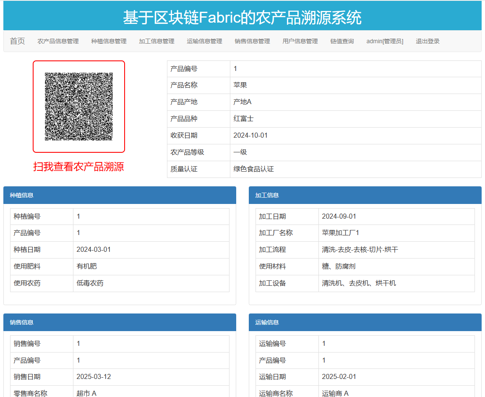
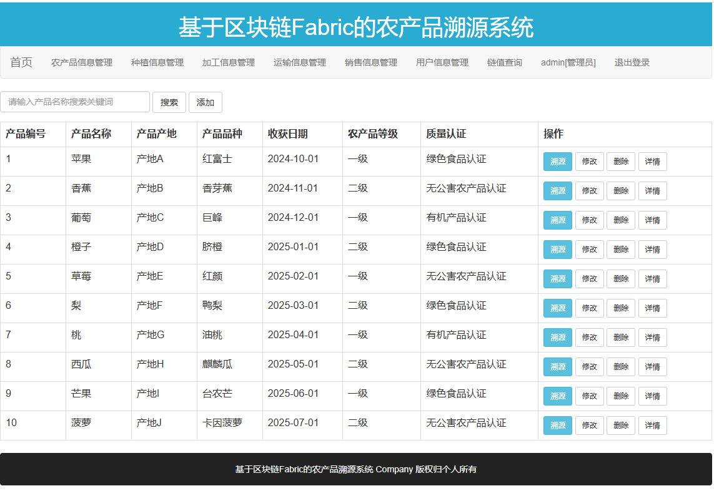
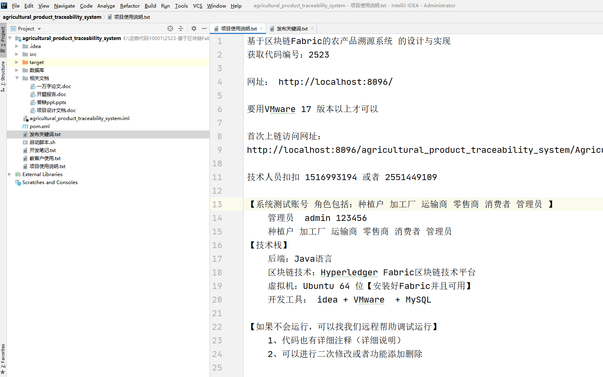
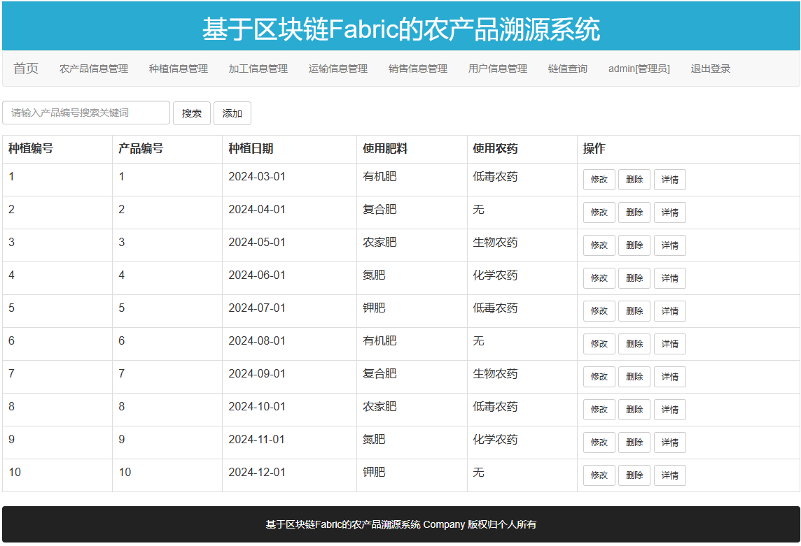
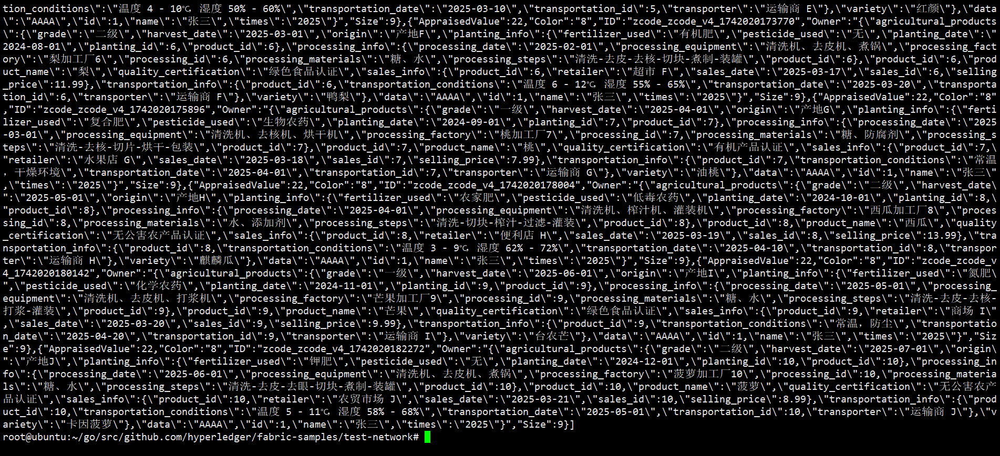
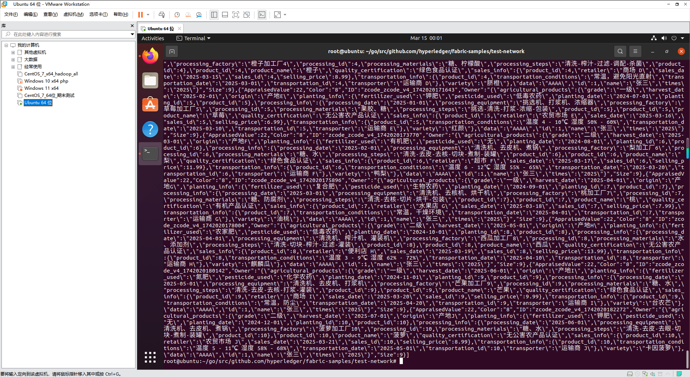
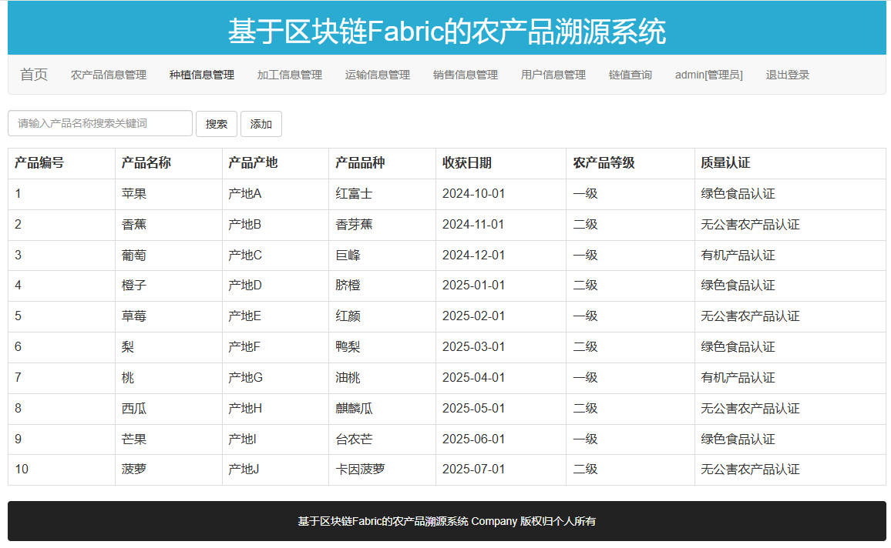

# agricultural_product_traceability_system
基于区块链Fabric的农产品溯源系统的设计与实现，角色包括：种植户 加工厂 运输商 零售商 消费者 管理员，支持二维码扫描查看农产品溯源

# B站演示视频地址   [https://www.bilibili.com/video/BV1SZ99Y3Egq/](https://www.bilibili.com/video/BV1eiQ2YxEbR/)

基于区块链Fabric的农产品溯源系统

获取代码编号：2523

# 农产品溯源详情

# 农产品管理

# 加工信息管理

# 文档配套资料

# 种植信息管理

# 虚拟机中链值查询

# 虚拟机界面截图

# 链值查询

【系统测试账号 角色包括：种植户 加工厂 运输商 零售商 消费者 管理员 】
    管理员  admin 123456
    种植户 加工厂 运输商 零售商 消费者 管理员
【技术栈】
    后端：Java语言
    区块链技术：Hyperledger Fabric区块链技术平台
    虚拟机：Ubuntu 64 位【安装好Fabric并且可用】
    开发工具： idea + VMware  + MySQL

【如果不会运行，可以找我们远程帮助调试运行】
    1、代码也有详细注释（详细说明）
    2、可以进行二次修改或者功能添加删除

支持代码定做，修改，文档撰写
定做和代码二次修改说明:
①和客户沟通确定需求
②确定技术细节，核心功能
③定做好联系客户看效果,效果满意,远程帮助客户调试运行好
④项目定做提供的服务:
  1.代码和测试数据
2.数据库说明文档
3.代码讲解视频
      4.免费调试部署运行(没有运行软件我们帮安装)
5.售后答疑，服务到答辩结束为止

# 获取源码方式
	获取源码请加扣扣 1516993194  或者  2551449109

